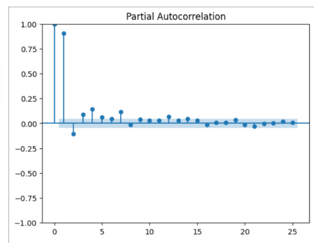
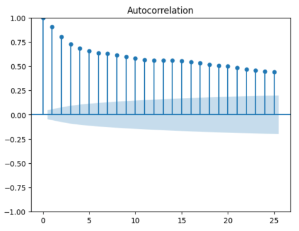
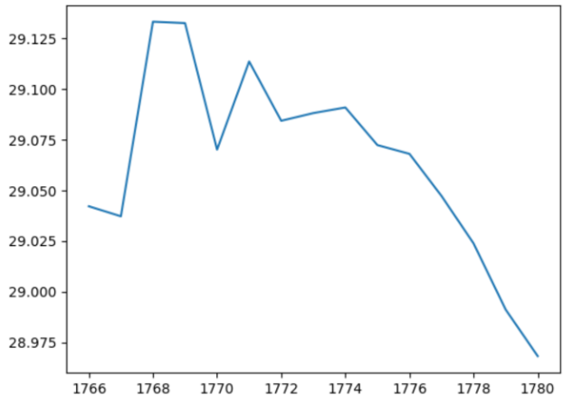
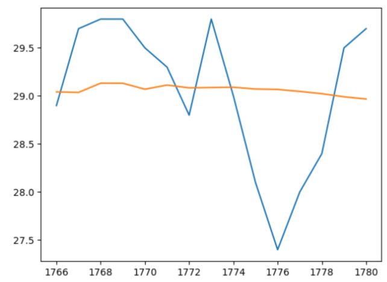

# Ex.No:04   FIT ARMA MODEL FOR TIME SERIES
# Date: 

## AIM:
To implement ARMA model in python.

## ALGORITHM:
1. Import necessary libraries.
2. Set up matplotlib settings for figure size.
3. Define an ARMA(1,1) process with coefficients ar1 and ma1, and generate a sample of 1000

data points using the ArmaProcess class. Plot the generated time series and set the title and x-
axis limits.

4. Display the autocorrelation and partial autocorrelation plots for the ARMA(1,1) process using
plot_acf and plot_pacf.
5. Define an ARMA(2,2) process with coefficients ar2 and ma2, and generate a sample of 10000

data points using the ArmaProcess class. Plot the generated time series and set the title and x-
axis limits.

6. Display the autocorrelation and partial autocorrelation plots for the ARMA(2,2) process using
plot_acf and plot_pacf.

## PROGRAM:
### Importing necessary libraries and loading and displaying the dataset:
```
import pandas as pd
import numpy as np
from matplotlib import pyplot
from statsmodels.tsa.ar_model import AutoReg
from statsmodels.tsa.stattools import adfuller
from statsmodels.tsa.arima.model import ARIMA
from statsmodels.graphics.tsaplots import plot_pacf, plot_acf
import sklearn.metrics

# Loading the dataset
df = pd.read_csv("rainfall.csv")

# Exploring the dataset
## Displaying the dataframe
print("Dataset:")
print(df)
```

### Extracting and Plotting the data the temperature data:
```
X = df['temp']
print("\nTemperature Data:")
print(X)
print("\nTemperature Plot:")
X.plot()
```

### Augmented Dickey-Fuller Test:
```
dtest = adfuller(X, autolag='AIC')
print("\nAugmented Dickey-Fuller Test:")
print("ADF:", dtest[0])
print("P value:", dtest[1])
print("No. of lags:", dtest[2])
print("No. of observations used for ADF regression:", dtest[3])
```

### Train-Test Split and Model Fitting:
```
X_train = X[:len(X) - 15]
X_test = X[len(X) - 15:]
p = 3  
q = 2  
ARMA_model = ARIMA(X_train, order=(p, 0, q)).fit()
print("\nARIMA Model Summary:")
print(ARMA_model.summary())
```

### Autocorrelation and Partial Autocorrelation Plots and Making Predictions:
```
print("\nPartial Autocorrelation Plot:")
pacf = plot_pacf(X, lags=25)
print("\nAutocorrelation Plot:")
acf = plot_acf(X, lags=25)
pred = ARMA_model.predict(start=len(X_train), end=len(X_train) + len(X_test) - 1, dynamic=False)
print("\nPredictions:")
print(pred)
```

### Model Evaluation and Plotting Predictions:
```
mse = sklearn.metrics.mean_squared_error(X_test, pred) 
rmse = mse ** 0.5
print("\nRoot Mean Squared Error (RMSE):", rmse)
print("\nTest Data vs Predictions:")
X_test.plot(label='Test Data')
pred.plot(label='Predictions')
pyplot.legend()
pyplot.show()
print("Dataset:")
print(df)
```

## OUTPUT:
### Partial Autocorrelation


### Autocorrelation


### Prediction Graph:


### Test:


RESULT:
Thus, a python program is created to fir ARMA Model successfully.
